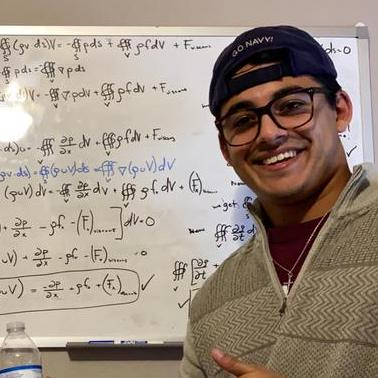
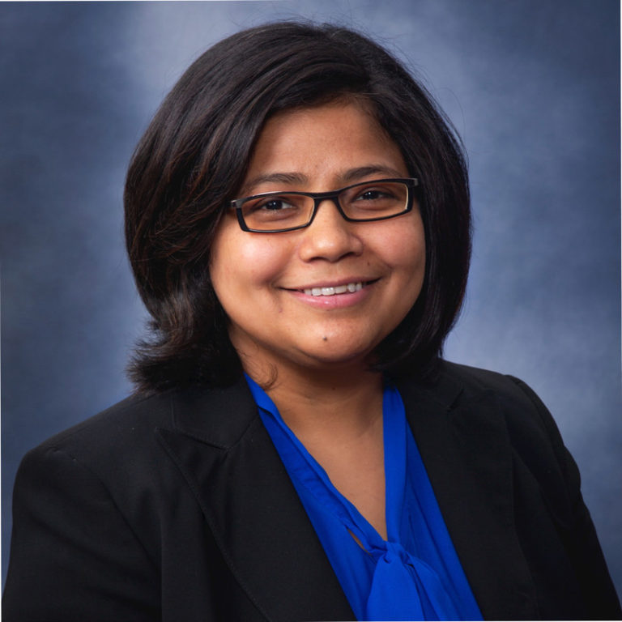

## Team

### Fall 2022

To be updated.

### Spring and Summer 2022

  

    
  

  

    
  

  

    
  

  

    
  

 

 

  

    <h3 style="text-align: center"><a href="https://nimrobotics.com/">Aakash</a></h3>
  

  

    <h3 style="text-align: center"><a href="https://www.linkedin.com/in/carlos-meisel/">Carlos Meisel</a></h3>
  

  

    <h3 style="text-align: center"><a href="https://www.linkedin.com/in/chris-notzon-8a8b0415a/">Carlos Meisel</a></h3>
  

  

    <h3 style="text-align: center"><a href="https://www.linkedin.com/in/ranjanamehta/">Ranjana K. Mehta</a></h3>
  

 
 
### Corresponding author

Aakash Yadav [aakash@tamu.edu](mailto:aakash@tamu.edu) 

<!-- <iframe src="poster.pdf" width="100%" height="500px"> </iframe>  -->

## Problem Statement

## Conceptualization

## Measurements
- [fNIRS](https://www.nimh.nih.gov/research/fNIRS/)
- [Tobii Nano](https://www.tobii.com/en-us/products/nano-eye-tracking/)
- [ECG](https://www.actiheart.com/)
- [EEG](https://www.brainproducts.com/en/products/brain-vision-recorder/)

## Tech Stack
- [Unity](https://unity3d.com/)
- [C#](https://docs.microsoft.com/en-us/dotnet/csharp/)
- [python](https://www.python.org/)
- [ROS](https://www.ros.org/)
- [MATLAB](https://www.mathworks.com/)

## Timeline

## Participate
In order to participate in this project, you will need to be physically present at the lab at TAMU. The experiment is currently undergoing internal testing, register [here](https://forms.gle/4YYi2Exzs5MyREZu5) to get notified when the experiment is ready.

## Provide Feedback
Our team is always looking for feedback on our project. Please contact us at [aakash@tamu.edu](mailto:aakash@tamu.edu) or [nimrobotics@gmail.com](mailto:nimrobotics@gmail.com).

<!-- reference the papers -->
## References
- [1] `Hopko, S. K., & Mehta, R. K. Neural Correlates of Trust in Automation: Considerations and Generalizability Between Technology Domains. Frontiers in Neuroergonomics, 26.`

- [2] `Hopko, S. K., Khurana, R., Mehta, R. K., & Pagilla, P. R. (2021). Effect of Cognitive Fatigue, Operator Sex, and Robot Assistance on Task Performance Metrics, Workload, and Situation Awareness in Human-Robot Collaboration. IEEE Robotics and Automation Letters, 6(2), 3049-3056.`

